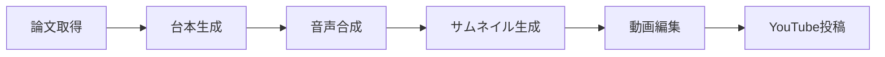

# Auto Video Product 🎬

EEG・脳波関連の論文を自動で取得し、AI生成のPodcast風解説動画を作成してYouTubeにアップロードするシステムです。

## 🌟 特徴

- **論文自動取得**: arXivとElsevier/Scopusから最新のEEG論文を自動取得
- **AI台本生成**: LM Studioを使用してPodcast風の対話形式台本を自動生成
- **音声合成**: VOICEVOXによる「ずんだもん」と「四国めたん」の音声生成
- **サムネイル生成**: Stable Diffusionによるアニメ風サムネイル自動生成
- **動画編集**: MoviePyによる字幕付き動画の自動作成
- **YouTube自動アップロード**: YouTube Data API v3による自動公開

## 📋 必要な環境

### ソフトウェア
- Python 3.10+
- [LM Studio](https://lmstudio.ai/) - ローカルLLM実行環境
- [VOICEVOX](https://voicevox.hiroshiba.jp/) - 音声合成エンジン

### APIキー
- Elsevier API Key（Scopus論文取得用）
- YouTube Data API v3の認証情報（OAuth 2.0）

## 🚀 セットアップ

### 1. 依存関係のインストール

```bash
pip install -r requirements.txt
```

### 2. 環境変数の設定

`.env`ファイルを作成して以下を設定:

```env
# YouTube API
YOUTUBE_API_KEY=your_api_key
YOUTUBE_CLIENT_SECRETS_FILE=client_secret.json

# LM Studio
LM_STUDIO_BASE_URL=http://localhost:1234/v1
LM_STUDIO_API_KEY=lm-studio

# VOICEVOX
VOICEVOX_BASE_URL=http://127.0.0.1:50021
VOICEVOX_SPEAKER_ID=3

# Elsevier/Scopus
ELSEVIER_API_KEY=your_elsevier_api_key

# 検索クエリ
PAPER_SEARCH_QUERY=EEG OR "brain waves" OR "brain-computer interface"
```

### 3. YouTube認証設定

1. Google Cloud Consoleで「YouTube Data API v3」を有効化
2. OAuth 2.0クライアントIDを作成
3. `client_secret.json`をプロジェクトルートに配置
4. 初回実行時にブラウザ認証が行われ、`token.json`が生成されます

### 4. LM StudioとVOICEVOXを起動

- LM Studioでモデルをロードし、サーバーを起動（デフォルト: `http://localhost:1234`）
- VOICEVOXを起動（デフォルト: `http://127.0.0.1:50021`）

## 📖 使い方

### 毎日の自動論文動画（推奨）

毎日10時に自動で論文を取得し、動画を生成・アップロードするサービスモード:

```bash
python daily_paper_video.py
```

### オプション

```bash
# テストモード（アップロードなし）
python daily_paper_video.py --test

# 1回だけ実行
python daily_paper_video.py --once

# 論文数を指定（デフォルト: 3件）
python daily_paper_video.py --once --papers 5

# テスト実行（アップロードなし、1回のみ）
python daily_paper_video.py --once --test
```

### 汎用トピックからの動画生成

任意のトピックからPodcast動画を生成:

```bash
python main.py --topic "OpenAIの新しいモデルについて解説"

# YouTubeへのアップロード付き
python main.py --topic "OpenAIの新しいモデルについて解説" --upload
```

## 🏗️ システム構成

```
auto-video-product/
├── daily_paper_video.py  # 論文動画自動生成メインスクリプト
├── main.py               # 汎用トピック動画生成スクリプト
├── paper_fetcher.py      # arXiv/Scopus論文取得
├── paper_script_generator.py  # 論文用台本生成
├── script_generator.py   # 汎用台本生成
├── audio_generator.py    # VOICEVOX音声合成
├── simple_image_gen.py   # Stable Diffusionサムネイル生成
├── image_generator.py    # ComfyUI画像生成（代替）
├── video_editor.py       # 動画編集・字幕付与
├── youtube_uploader.py   # YouTube自動アップロード
└── requirements.txt      # 依存パッケージ
```

## 🔄 処理フロー



1. **論文取得**: arXivとScopusから最新論文を取得
2. **台本生成**: LM Studioで対話形式の台本をJSON生成
3. **音声合成**: VOICEVOXで各セリフを音声化
4. **サムネイル生成**: Stable Diffusionでアニメ風画像生成
5. **動画編集**: MoviePyで画像+音声+字幕を合成
6. **YouTube投稿**: API経由で自動アップロード

## 🎭 キャラクター

| キャラクター | 役割 | 話者ID |
|:---:|:---:|:---:|
| ずんだもん | 好奇心旺盛なボケ役 | 3 |
| 四国めたん | 知的なツッコミ・解説役 | 2 |

## ⚙️ 各モジュールの単体テスト

```bash
# 論文取得のテスト
python paper_fetcher.py

# 台本生成のテスト
python script_generator.py

# 音声生成のテスト（script.json必要）
python audio_generator.py

# サムネイル生成のテスト
python simple_image_gen.py

# 動画生成のテスト（thumbnail.png, output_audio/必要）
python video_editor.py
```

## 📝 ライセンス

MIT License

## 🙏 謝辞

- [VOICEVOX](https://voicevox.hiroshiba.jp/) - 音声合成エンジン
- [LM Studio](https://lmstudio.ai/) - ローカルLLM実行環境
- [Stable Diffusion](https://stability.ai/) - 画像生成モデル
